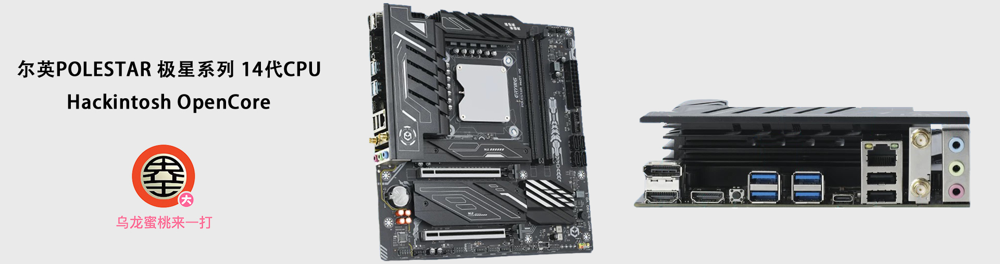

## 尔英 POLESTAR H770  黑苹果 OpenCore EFI



[OpenCore 1.0.3](https://github.com/acidanthera/OpenCorePkg)  适用于尔英极星14代全系CPU i5 / i7 / i9

### macOS

- macOS Monterey  12.x
- macOS Ventura    13.x 
- macOS Sonoma   14.x
- macOS Sequoia   15.x

### 硬件

- 芯片组: HM770
- 处理器: 英特尔14代 i9-14900HX
- 内   存: 光威32G（16G*2）DDR5 6000MHz
- 硬   盘: 致钛PC005 Active 256GB Windows
- 硬   盘: 梵想S500 PRO 2TB  DATA + MacOS
- 独   显: 技嘉 AMD Radeon RX 5600 XT DDR6 6GB
- 核   显: 英特尔超核心显卡770（仅支持Window,无法再MacOS中使用）
- 声   卡: 瑞昱 ALC897
- 有线网卡: 瑞昱 RTL8125
- 无线网卡: 英特尔 AX211

### BIOS设置

```
Advanced
  |-- Super IO Configuraion
     |-- Serial Port 1 Configuration : Disabled
  
  |-- PowerManagement Configuration
     |-- Wake on LAN : Disabled
  
  |-- CSM Configuration
	      |-- Video：UEFI  ( need reboot )
	      |-- CSM Auto Switch : Disabled 
	      |-- CSM Support : Disabled
 
Chipset
  |-- Primary Display : Auto
  |-- VT-d : Enabled

Boot
  |-- Fast Boot : Disabled

Security
  |-- Secure Boot Mode  : Disabled

```

### 注意事项

 - 安装成功后必须使用[OCAuxiliaryTools](https://github.com/ic005k/OCAuxiliaryTools) 生成你自己的 SMBIOS
 - 此EFI中的英特尔无线网卡驱动[AirportItlwm_Sequoia.kext](https://github.com/OpenIntelWireless/itlwm/releases)仅适用于 MacOS 15 Sequoia,安装其它版本请自行下载替换适合的驱动，安装成功后需使用[OCLP-Mod by 老八](https://github.com/laobamac/OCLP-Mod/releases)安装英特尔无线网卡驱动补丁方可使用
 - 如需使用没有小核心的CPU，必须取消勾选配置文件中Kernel--ProvideCurrentCpuinfo选项


### 联系我们

QQ群: 23304408


### 常用工具

- [Hackintool](https://github.com/headkaze/Hackintool) 
- [OCAuxiliaryTools](https://github.com/ic005k/OCAuxiliaryTools) AKA `OCAT`.
- [OpenCore Configurator](https://mackie100projects.altervista.org/opencore-configurator/) AKA `OCC`.
- [gibMacOS](https://github.com/corpnewt/gibMacOS) Build your own MacOS image.
- [ProperTree](https://github.com/corpnewt/ProperTree) Plist editor.